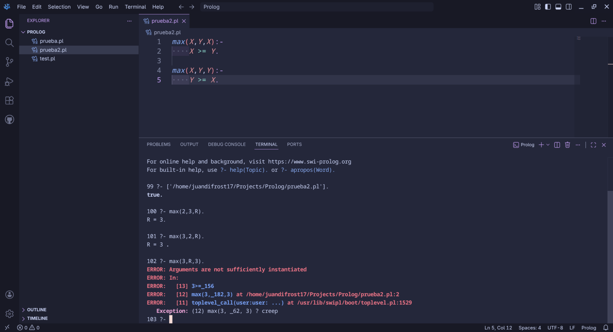
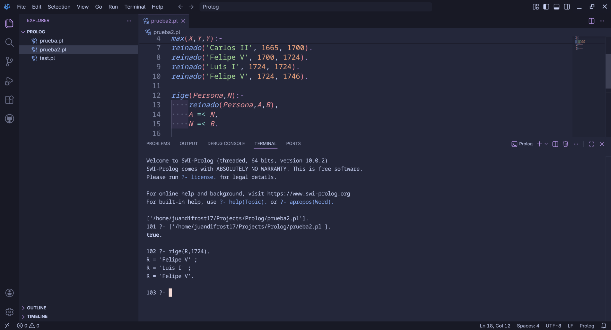
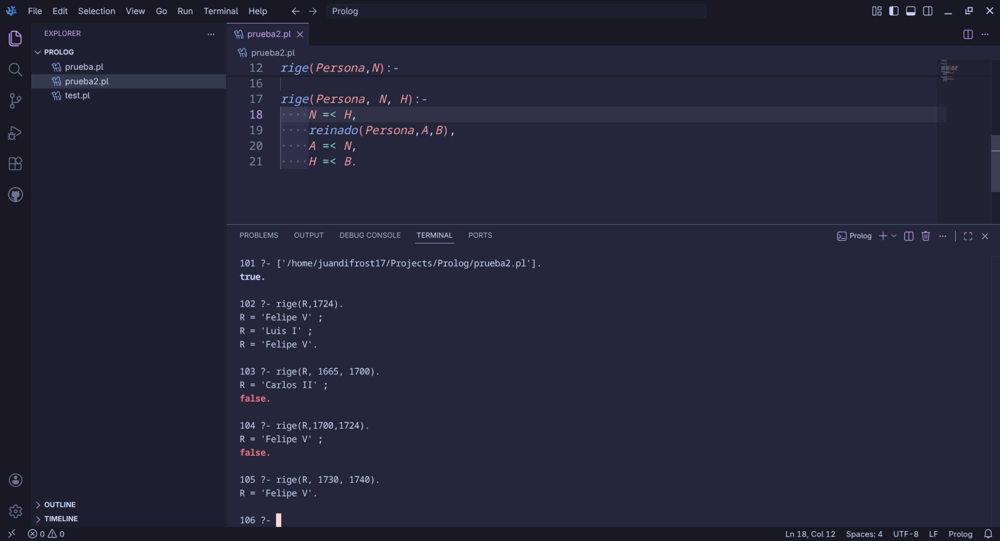
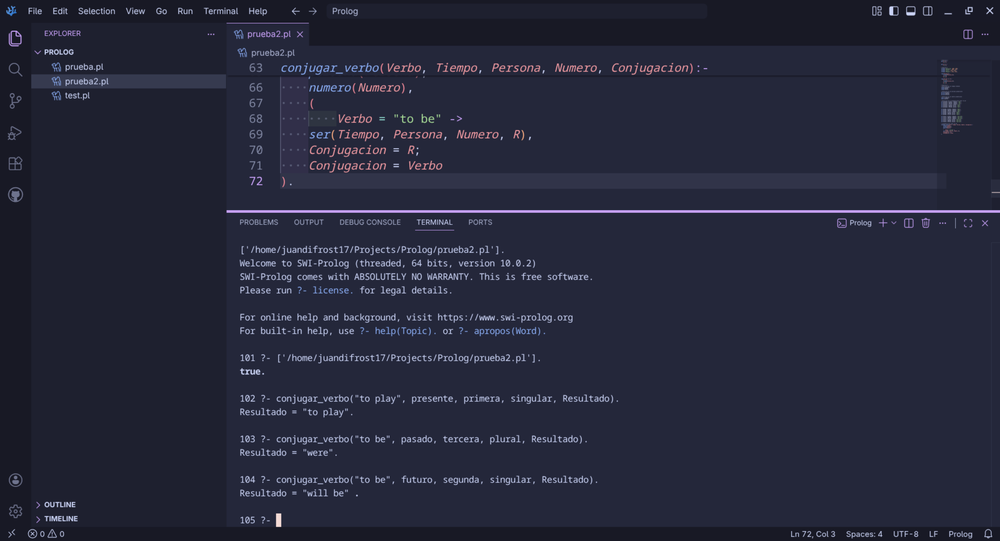

# Taller 3 - Prolog: Bases de Conocimiento y Consultas

## Descripción

Este taller corresponde a una continuación del trabajo con el lenguaje de programación lógica **Prolog**, trabajado en el archivo `taller3.pl`. Se implementaron predicados para comparación de valores, consultas sobre datos históricos y conjugación de verbos en inglés mediante una base de conocimiento.

---

## Ejercicios implementados

### Ejercicio 1 — Máximo entre dos valores

Se define el predicado `max/3` que determina cuál de dos números es el mayor, usando comparación aritmética con dos cláusulas simétricas.

### Ejercicio 2 — Reinados históricos y consultas temporales

Se construye una base de conocimiento con los reinados de monarcas españoles (`Carlos II`, `Felipe V`, `Luis I`) y se definen dos predicados:

- `rige/2`: determina qué persona reinaba en un año `N` dado.
- `rige/3`: determina qué persona reinaba durante todo un rango de años `[N, H]`.

> Nota: Felipe V aparece dos veces en la base de conocimiento, ya que reinó en dos periodos distintos (1700–1724 y 1724–1746).

### Ejercicio 3 — Conjugación del verbo *to be*

Se define una base de conocimiento completa con los tiempos verbales (`presente`, `pasado`, `futuro`), personas gramaticales (`primera`, `segunda`, `tercera`) y números (`singular`, `plural`). A partir de ella, el predicado `conjugar_verbo/5` permite obtener la forma correcta del verbo *to be* en inglés para cualquier combinación válida.

---

## Predicados implementados

| Predicado | Aridad | Descripción |
|-----------|--------|-------------|
| `max/3` | 3 | Devuelve el mayor de dos números |
| `reinado/3` | 3 | Hecho: monarca, año de inicio y año de fin |
| `rige/2` | 2 | Quién reinaba en el año N |
| `rige/3` | 3 | Quién reinaba durante el rango [N, H] |
| `tiempo/1` | 1 | Tiempos verbales válidos |
| `persona/1` | 1 | Personas gramaticales válidas |
| `numero/1` | 1 | Números gramaticales válidos |
| `ser/4` | 4 | Conjugación del verbo *to be* |
| `conjugar_verbo/5` | 5 | Conjugador general con soporte para *to be* |

---

## Capturas de ejecución

### Captura 1 — Predicado `max/3`

### Captura 2 — Predicado `rige/2`

### Captura 3 — Predicado `rige/3`

### Captura 4 — Predicado `conjugar_verbo/5`

---

## Archivos del repositorio

| Archivo | Descripción |
|--------|-------------|
| `taller3.pl` | Código fuente con todos los predicados |
| `Capturas - Prolog 2.pdf` | Capturas de ejecución en PDF |
| `capturas/` | Carpeta con las capturas en formato PNG |
